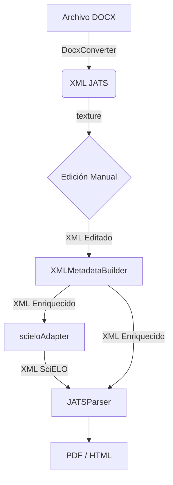

# Flujo de Trabajo

El flujo de trabajo en SUMARC está diseñado para llevar un documento desde su formato original de autor (típicamente DOCX) hasta formatos de publicación estandarizados y enriquecidos. A continuación se describe el proceso paso a paso:

## 1. Entrada y Conversión Inicial
El proceso comienza con un archivo **DOCX**.
*   Se utiliza el plugin **DocxConverter** para transformar este archivo DOCX en un archivo **XML JATS**.
*   Este es el primer paso crítico para estructurar el contenido semánticamente.

## 2. Edición y Corrección
Una vez obtenido el XML JATS, es posible que se requieran correcciones o ajustes manuales.
*   Aquí entra en juego **texture**, que proporciona un editor visual para el XML.
*   El usuario puede modificar el contenido directamente sobre el XML JATS de una manera intuitiva (WYSIWYG) sin necesitar conocimientos profundos de XML.

## 3. Enriquecimiento de Metadatos
Para mejorar la calidad y la interoperabilidad del documento:
*   El plugin **XMLMetadataBuilder** procesa el XML JATS.
*   Este paso completa y mejora los metadatos del artículo, asegurando que cumpla con los requisitos necesarios para indexación y preservación.

## 4. Adaptación (Opcional/Específico)
Si el destino de la publicación es SciELO:
*   Se utiliza el **scieloAdapter**.
*   Este componente adapta el XML JATS para que sea un XML válido según los estrictos estándares de SciELO.

## 5. Salida y Visualización Final
Finalmente, para la lectura y distribución:
*   El **JATSParser** toma el XML JATS (ya editado y enriquecido) y genera los formatos de consumo final.
*   Produce archivos **PDF** y **HTML** listos para ser publicados en la web o descargados por los lectores.

---

