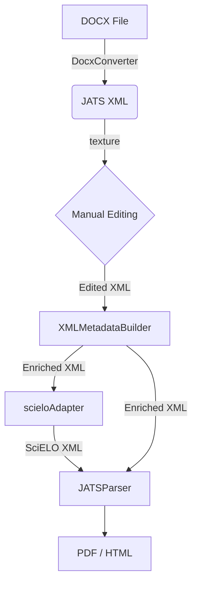

# Workflow

The workflow in SUMARC is designed to take a document from its original author format (typically DOCX) to standardized and enriched publication formats. The process is described step-by-step below:

## 1. Input and Initial Conversion
The process begins with a **DOCX** file.
*   The **DocxConverter** plugin is used to transform this DOCX file into a **JATS XML** file.
*   This is the critical first step to semantically structure the content.

## 2. Editing and Correction
Once the JATS XML is obtained, manual corrections or adjustments may be required.
*   This is where **texture** comes in, providing a visual editor for the XML.
*   The user can modify the content directly on the JATS XML in an intuitive way (WYSIWYG) without needing deep XML knowledge.

## 3. Metadata Enrichment
To improve the quality and interoperability of the document:
*   The **XMLMetadataBuilder** plugin processes the JATS XML.
*   This step completes and improves the article's metadata, ensuring it meets the necessary requirements for indexing and preservation.

## 4. Adaptation (Optional/Specific)
If the publication destination is SciELO:
*    The **scieloAdapter** is used.
*   This component adapts the JATS XML to be a valid XML according to strict SciELO standards.

## 5. Output and Final Visualization
Finally, for reading and distribution:
*   The **JATSParser** takes the JATS XML (already edited and enriched) and generates the final consumption formats.
*   It produces **PDF** and **HTML** files ready to be published on the web or downloaded by readers.

---

